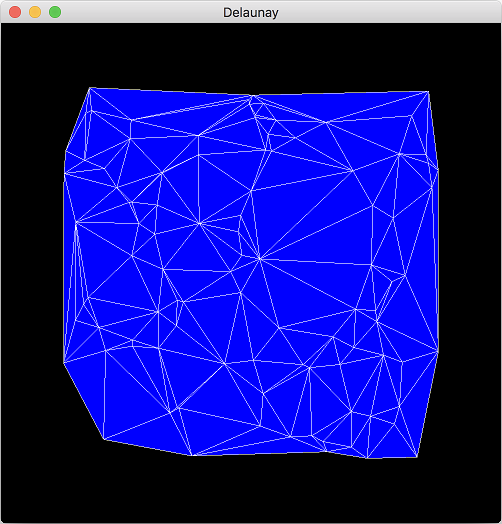

# Delaunay
- Delaunay triangulation in C++.
- The results of Delaunay triangulation are displayed in OpenGL.

### Installation of the library
- brew tap homebrew/versions
- brew install glfw3 eigen

### Screen Shot

